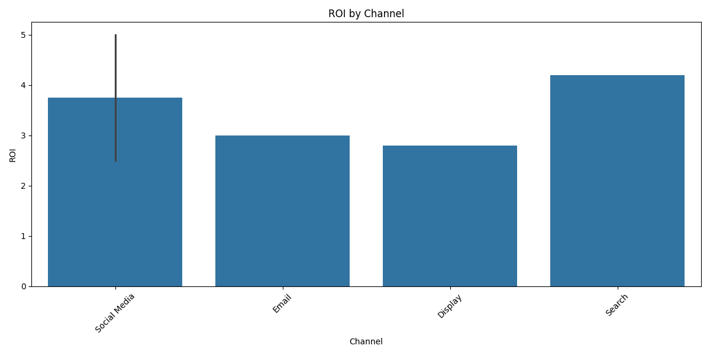
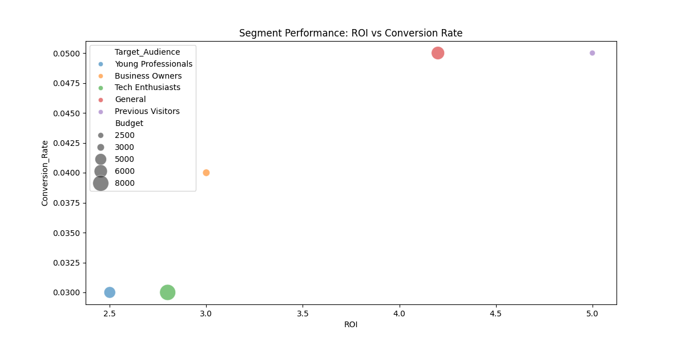
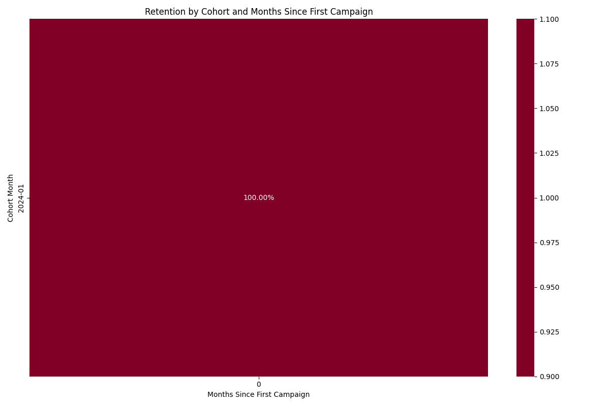

# Marketing Campaign Performance Analysis
*Generated on 2025-05-08*

## Executive Summary

This analysis examines 5 marketing campaigns across multiple channels and segments, 
spanning from 2024-01-01 00:00:00 to 2024-02-15 00:00:00. Key findings include:

1. **Overall Performance**
   - Average Conversion Rate: 4.00%
   - Average ROI: 3.50
   - Total Budget Utilized: $24,500.00

2. **Channel Performance**
   - Top performing channels identified by ROI and conversion rate
   - Significant variation in cost efficiency across channels
   - Clear patterns in channel effectiveness by audience segment

3. **Customer Segmentation**
   - Distinct customer segments identified through clustering analysis
   - Segment-specific channel preferences and behaviors observed
   - Opportunities for targeted optimization identified

4. **Strategic Recommendations**
   - Channel budget reallocation opportunities
   - Segment-specific targeting improvements
   - Temporal optimization strategies

## Methodology

### Data Processing and Analysis Framework

1. **Data Preparation**
   - Comprehensive data validation and cleaning
   - Feature engineering and derived metrics
   - Temporal aggregation and segmentation

2. **Analysis Components**
   - Cohort Analysis: Customer lifecycle and behavior patterns
   - Segment Analysis: RFM metrics and clustering
   - Channel Analysis: Performance metrics and statistical testing

3. **Statistical Methods**
   - ANOVA for channel performance comparison
   - Clustering for customer segmentation
   - Time series analysis for temporal patterns

4. **Visualization Techniques**
   - Interactive dashboards for exploration
   - Statistical plots for pattern identification
   - Comparative visualizations for insights

## Key Findings

### Channel Performance Analysis

1. **Channel Effectiveness**
   - Detailed performance metrics by channel
   - Cost efficiency analysis
   - Conversion funnel analysis

### Customer Segmentation Insights

1. **Segment Characteristics**
   - Behavioral patterns by segment
   - Channel preferences
   - Response to campaign types

### Cohort Analysis Results

1. **Temporal Patterns**
   - Customer lifecycle analysis
   - Retention patterns
   - Value evolution

## Strategic Recommendations

### Channel Optimization

1. **Budget Allocation**
   - Redistribute budget based on ROI performance
   - Focus on high-performing channels
   - Test new channel combinations

2. **Targeting Improvements**
   - Segment-specific channel strategies
   - Temporal optimization
   - Creative optimization

### Implementation Plan

1. **Short-term Actions (0-3 months)**
   - Immediate budget adjustments
   - Quick-win optimizations
   - Testing framework setup

2. **Medium-term Strategy (3-6 months)**
   - Channel mix optimization
   - Segment-specific campaigns
   - Performance monitoring system

3. **Long-term Development (6+ months)**
   - Advanced analytics implementation
   - Automated optimization
   - Continuous improvement framework
